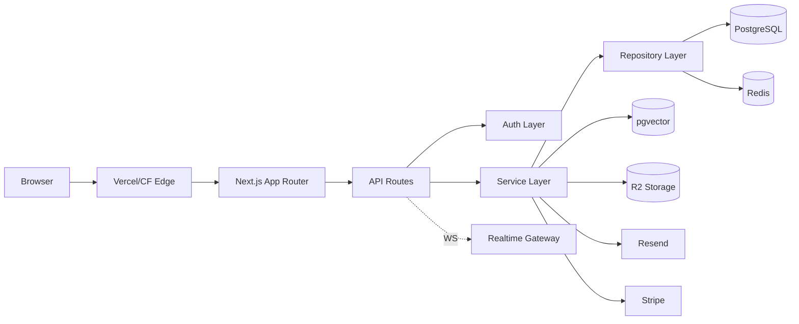
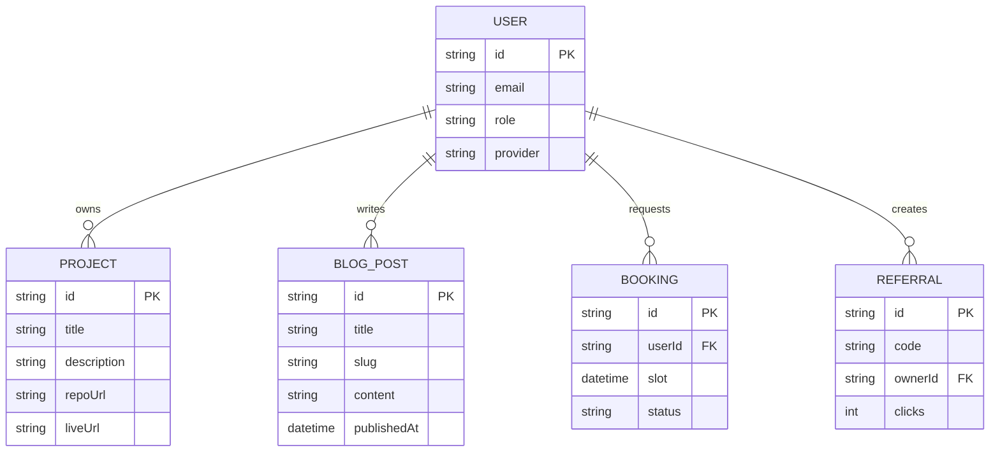

# Portfolio SaaS — Build Spec

**Role:** Principal-level full-stack engineer. Build a production-quality personal portfolio that shows senior judgment, not maximum buzzword surface area. Every module you add must be defensible in an interview — "why did you build it this way."

**Context:** Personal portfolio + light SaaS features, built to support SDE applications at a Google/Amazon/Microsoft bar. Reviewers are technical and will read the code, not just click the demo.

## Stack

- **Frontend:** Next.js 16 (App Router, Turbopack default), TypeScript, Tailwind, shadcn/ui
- **DB/ORM:** PostgreSQL + Prisma
- **Cache:** Redis — sessions, rate limiting, hot-path reads
- **Auth:** Better Auth — Google + GitHub OAuth, sessions, RBAC (admin/user). (Auth.js v5 is a fine swap if you're more familiar with it — same shape, more boilerplate.)
- **Storage:** Cloudflare R2 (S3-compatible), auto WebP/AVIF on upload
- **Realtime:** WebSockets — live chat, notifications, activity feed, online status
- **AI:** pgvector (RAG over site content) + an LLM API for generation; optional in-browser WebLLM demo (a contained, no-backend-cost chat toy — genuinely worth keeping)
- **Email:** Resend
- **Payments:** Stripe (add Razorpay only if you specifically want India-side rails)
- **Booking:** Cal.com API/embed
- **Deploy:** Docker, GitHub Actions, Vercel
- **Testing:** Vitest (unit), Playwright (E2E), Lighthouse CI (≥95), axe-core (a11y)
- **Observability:** Sentry + Vercel Analytics/Plausible — sufficient at this traffic scale
- **Architecture:** modular monolith, feature-based folders, repository + service layers, DI where it earns its keep, SOLID/DRY

**Cut from core** — each of these solves a multi-service/multi-tenant problem a single Next.js monolith doesn't have. Add any back individually, in the relevant phase below, if a specific JD calls for it:
Kafka/RabbitMQ + CQRS + Redlock · gRPC-Web + GraphQL federation · mTLS + SAML + Vault/KMS · chaos engineering + Raft visualization · full Prometheus/Grafana/Jaeger stack · DuckDB/Flink ETL pipeline.

## Architecture

## Core entities (starter — extend per phase)

## Features (grouped, unchanged from your draft — the feature list wasn't the problem)

- **Public site:** landing, about, skills, experience, projects, resume (PDF viewer), blog, contact — responsive, dark mode, SEO (OG + sitemap), WCAG a11y
- **Nav/search:** full-text search, tags/filters/sort/pagination, Cmd+K palette, keyboard shortcuts
- **Admin CMS:** CRUD projects/blog/skills, inbox, analytics, referral management
- **Integrations:** GitHub/LeetCode/Codeforces APIs → coding dashboard + contribution heatmap
- **Comms:** live chat, WS notifications, push notifications, newsletter, activity feed, online status, personalized welcome for returning visitors
- **Monetization:** Stripe checkout + webhooks, invoices, Cal.com consulting booking
- **Growth:** referral links, dynamic QR, click analytics, share cards
- **Platform:** PWA/offline, i18n, theme switcher, changelog, API docs page

## Phases — build in order. Stop after each. Wait for "next."

1. **Foundation** — scaffold, TS/Tailwind/shadcn, CI (lint/typecheck/test), Docker Compose (app+pg+redis), a11y+SEO baseline
2. **Auth & RBAC** — OAuth (Google/GitHub), sessions, admin/user roles, protected routes
3. **CMS + Admin** — Prisma schema, CRUD APIs, admin dashboard UI, image upload → R2
4. **Public site & search** — all public pages, full-text search, filters/pagination, resume viewer, share cards, OG images
5. **Integrations & realtime** — GitHub/LeetCode/Codeforces fetchers (Redis-cached), heatmap + coding dashboard, WS server (chat/notifications/activity feed/online status)
6. **AI layer** — content embeddings, RAG chatbot endpoint + UI, resume analyzer, optional WebLLM demo
7. **Payments & growth** — Stripe checkout+webhooks, Cal.com booking, referral links + QR generator, click analytics
8. **Hardening** — rate limiting (Redis token bucket), CSRF/XSS/zod validation, CSP headers, structured logging, Sentry, cache strategy, perf pass (Lighthouse ≥95), full test pass
9. **Polish (+ optional lab)** — PWA/offline, i18n, cmd-k, keyboard shortcuts, changelog, API docs; optional `/lab` page demoing ONE distributed-systems concept if you want that interview story — a focused, well-explained toy, not load-bearing infra

## Per-phase output — keep it tight

1. Files changed/added (path + code)
2. 3–5 bullets: key decisions + trade-offs → append to a running `INTERVIEW_NOTES.md` instead of re-explaining each phase
   Don't restate this spec, and don't produce folder/API/DB-table essays for phases that haven't started yet.

## Cross-cutting (state once, applies everywhere)

- **Caching:** Redis for session/rate-limit/hot GETs; ISR/SSG for public pages
- **Security:** zod on all inputs, CSRF on state-changing forms, CSP via middleware, Prisma parameterizes queries
- **CI/CD:** GH Actions → lint/typecheck/test → build → Docker → Vercel (preview per PR, prod on main)
- **Tests:** unit (services/utils) + integration (API routes, test DB) + E2E (auth, admin CRUD, booking, payment) + Lighthouse/axe gates
